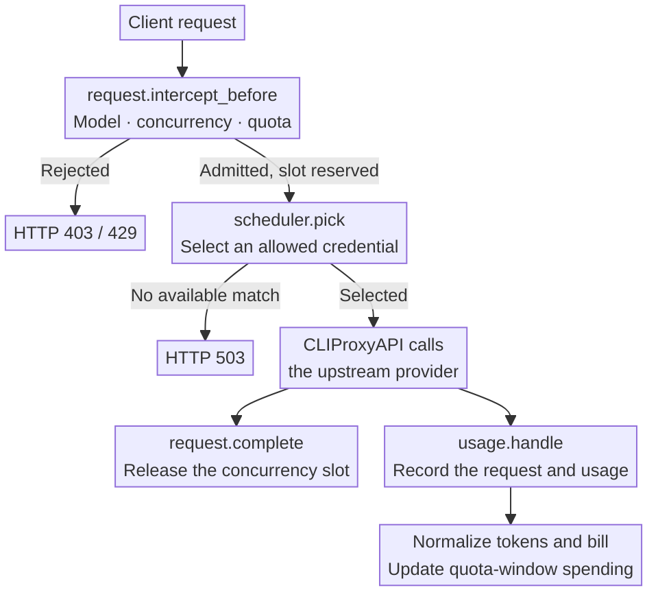
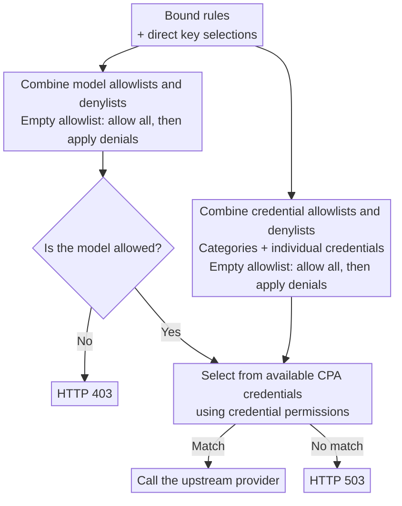

<div align="center">
  <h1>CPA Key Billing</h1>
  <p><strong>Per-key billing, subscription quotas, and routing for <a href="https://github.com/router-for-me/CLIProxyAPI">CLIProxyAPI</a>.</strong></p>
  <p>
    <a href="https://github.com/haowang02/cpa-plugin-key-billing/releases/latest"></a>
    <a href="https://github.com/haowang02/cpa-plugin-key-billing/actions/workflows/check.yml"></a>
    
    <a href="./LICENSE"></a>
  </p>
  <p><strong>English</strong> · <a href="./README.md">简体中文</a></p>
</div>


## Features

- Set spending, token, and request quotas for each API key, with independent or shared reset schedules.
- Apply separate rates to requests that exceed a long-context input threshold.
- Limit concurrent requests per API key.
- Control access to models and upstream credentials with routing rules.
- Use model reference prices from [models.dev](https://models.dev/), with optional custom overrides.

## How it works

Before a request reaches an upstream provider, the plugin checks subscription quotas, concurrency, and routing. After execution, CLIProxyAPI supplies usage through `usage.handle`. The plugin uses that record to store the request event, calculate its cost, and update spending for the current quota window.



## Requirements

- CLIProxyAPI **7.2.143 or later**.
- A CLIProxyAPI build with plugin support. Builds labeled `no-plugin` cannot load this plugin.

## Installation

Run the installer from your CLIProxyAPI directory.

On macOS or Linux:

```sh
curl -LsSf https://raw.githubusercontent.com/haowang02/cpa-plugin-key-billing/main/install.sh | sh
```

On Windows, stop CLIProxyAPI first, then run this in PowerShell:

```powershell
irm https://raw.githubusercontent.com/haowang02/cpa-plugin-key-billing/main/install.ps1 | iex
```

The installer places the plugin in `plugins/` under the current directory. Restart CLIProxyAPI after installing or upgrading.

For manual installation, download the archive for your platform from [Releases](https://github.com/haowang02/cpa-plugin-key-billing/releases/latest), then extract the library into CLIProxyAPI’s `plugins/` directory:

```text
plugins/cpa-key-billing.so       # Linux
plugins/cpa-key-billing.dylib    # macOS
plugins/cpa-key-billing.dll      # Windows
```

## Configuration

Add the following to your CLIProxyAPI configuration:

```yaml
plugins:
  enabled: true
  dir: "plugins"
  configs:
    cpa-key-billing:
      enabled: true
      debug: false # Include routing and reference-price matching in debug logs
      codex_fast_mode_billing: false # Charge 2.5× for Codex priority requests
      mask_api_key_view_emails: false # Mask email addresses in API key account views
      allow_api_key_quota_reset: false # Allow API key users to reset accessible Codex auth file quotas using upstream reset credits
      state_file: "plugins/cpa-key-billing-state-v1.db"
```

> [!WARNING]
> Back up your data file before upgrading.
>
> - Databases created by v1.0.0 or later are migrated automatically.
> - JSON and SQLite files from v0.8.4 or earlier cannot be migrated. Point `state_file` to a new file instead.

Restart CLIProxyAPI and open **API Key Billing** in the management panel. Review model pricing, create subscription plans, and bind the API keys whose quotas you want to enforce.

### End-to-end setup from a vanilla CLIProxyAPI

This procedure starts with a clean Linux host. Replace the paths as needed, but keep the CPA binary, plugin directory,
configuration, and state database tied to the same CPA instance.

1. **Prepare CLIProxyAPI.** Download a plugin-capable Linux build from the CPA release page, place it in its own directory,
   and create the plugin and auth directories:

   ```sh
   mkdir -p "$HOME/cliproxyapi/plugins" "$HOME/cliproxyapi/auth"
   cd "$HOME/cliproxyapi"
   # Place the downloaded cli-proxy-api binary here
   chmod 0755 cli-proxy-api
   ```

2. **Create the CPA configuration and auth files.** Configure the listen port, auth directory, downstream API keys, and plugin
   directory in `~/cliproxyapi/config.yaml`. Start CPA once, complete Codex or other upstream authentication through the CPA
   management center, and stop it again. Never put access tokens in Git or copy them into this repository.

   ```yaml
   port: 8088
   auth-dir: /home/ubuntu/cliproxyapi/auth
   plugins:
     enabled: true
     dir: /home/ubuntu/cliproxyapi/plugins
   ```

3. **Install this plugin.** From the CPA root, run the installer, or download the matching dynamic library from a release and
   place it in `~/cliproxyapi/plugins/`:

   ```sh
   curl -LsSf https://raw.githubusercontent.com/moreD/cpa-plugin-key-billing/main/install.sh | sh
   ```

   The installed file should be `plugins/cpa-key-billing.so` (`.dylib` on macOS or `.dll` on Windows).

4. **Enable the plugin and choose its state database.** Merge this configuration into the same `config.yaml`. Absolute paths
   prevent a changed service working directory from creating a second database:

   ```yaml
   plugins:
     enabled: true
     dir: /home/ubuntu/cliproxyapi/plugins
     configs:
       cpa-key-billing:
         enabled: true
         scheduler_mode: smart
         state_file: /home/ubuntu/cliproxyapi/plugins/cpa-key-billing-state-v1.db
   ```

5. **Run it as a user service.** For a first test, run `./cli-proxy-api -config ./config.yaml` directly. For long-running
   deployments, use a systemd user service so CPA is supervised:

   ```ini
   # ~/.config/systemd/user/cliproxyapi.service
   [Unit]
   Description=CLIProxyAPI Service
   After=network-online.target

   [Service]
   WorkingDirectory=%h/cliproxyapi
   ExecStart=%h/cliproxyapi/cli-proxy-api -config %h/cliproxyapi/config.yaml
   Restart=on-failure
   RestartSec=3

   [Install]
   WantedBy=default.target
   ```

   ```sh
   systemctl --user daemon-reload
   systemctl --user enable --now cliproxyapi.service
   systemctl --user status cliproxyapi.service
   ```

6. **Verify the plugin and data flow.** Confirm that the log reports a successful plugin registration, then open
   `http://<CPA host>:8088/v0/resource/plugins/cpa-key-billing/ui`:

   ```sh
   journalctl --user -u cliproxyapi.service -n 100 --no-pager | grep 'plugin registered'
   curl -fsS http://127.0.0.1:8088/
   ```

   Request billing events, the 5-hour/7-day windows returned in Codex responses, and reset counts plus expiration times from the
   backend quota query are stored in the same `state_file` and shown in the auth tab. The backend timer checks every hour; auths
   with no recorded request usage refresh randomly after 40–80 minutes, while auths with request usage refresh after 1,200–1,600 minutes.

Before upgrading, back up the state database and restart through the user service:

```sh
cp plugins/cpa-key-billing-state-v1.db "plugins/cpa-key-billing-state-v1.db.$(date -u +%Y%m%dT%H%M%SZ).bak"
systemctl --user restart cliproxyapi.service
```

### Migrating the legacy scheduler and API-key limits

If the CPA configuration still has the separate `smart-load-balancer` plugin and
`api-keys[].cost-limits`, run the migration script before switching to this
plugin:

```sh
python3 scripts/migrate_legacy_settings.py --config /path/to/config.yaml
```

It writes a reviewed `config.yaml.migrated.yaml` and a plan manifest. The
manifest converts each legacy `7d` dollar limit into a 7-day subscription plan,
binds keys by their non-reversible caller-scope hash, removes the legacy
`cost-limits` fields, and replaces the legacy scheduler with the embedded smart scheduler. Legacy `12h`
limits are intentionally ignored. The separate smart-load-balancer plugin and
its registry source are removed from the migrated configuration; the embedded
defaults retain its 24-hour sticky window and eight-request profile limit.

After reviewing and activating the migrated configuration, sync the keys and
plans through the running plugin:

```sh
CPA_MANAGEMENT_KEY='your-management-key' \
  python3 scripts/migrate_legacy_settings.py \
    --config /path/to/config.yaml.migrated.yaml \
    --manifest /path/to/config.yaml.migration.json --apply
```

Use `--in-place` only when you want the script to create a timestamped backup
and replace the original configuration automatically.

## Access

Administrators can open the plugin from the management panel or visit it directly:

```text
http(s)://<CLIProxyAPI address>/v0/resource/plugins/cpa-key-billing/ui
```

API key holders can use their own key to view their subscription and usage:

```text
http(s)://<CLIProxyAPI address>/v0/resource/plugins/cpa-key-billing/ui#account
```

## Billing and quotas

- Keys without a subscription plan still have their usage recorded, but have no subscription quota limit.
- A plan can contain multiple quota windows. Each window can limit spending in USD, tokens, requests, or any combination of the three.
- Usage is tracked separately for each key, even when keys share a plan. Independent cycles start when the first request is admitted. Shared cycles use the configured schedule for every bound key.
- A manual quota reset keeps shared reset times unchanged. Independent cycles restart when the next request is admitted.
- Custom model prices take precedence over models.dev reference prices. Requests are rejected if neither is available.
- Request events are retained for 365 days.

## Routing rules

Bind routing rules on the API key page, or set model and credential permissions directly on a key. Each selection cycles through three states: unselected, allowed (check mark), and denied (cross).

A credential-category selection covers all credentials in that category, including credentials added later. You can deny individual credentials within an allowed category.

The plugin combines all bound rules with the key’s direct selections. Model and credential permissions are evaluated separately: allowlists are combined, denylists are combined, and denials take precedence. An empty allowlist permits everything that is not explicitly denied.



## Rejection responses

| Condition | HTTP status | `type` | `code` |
| --- | --- | --- | --- |
| Concurrency limit reached | `429` | `rate_limit_error` | `rate_limit_exceeded` |
| Subscription quota exhausted | `429` | `rate_limit_error` | `rate_limit_exceeded` |
| Model access denied | `403` | `permission_error` | `insufficient_quota` |
| No available credential matches the routing rules | `503` | `server_error` | `internal_server_error` |
| A bound routing rule is missing or invalid | `503` | `server_error` | `routing_configuration_error` |
| Model has no price | `503` | `cpa_key_billing_error` | `model_price_error` |

## Acknowledgments

- [LINUX DO](https://linux.do/) community.
