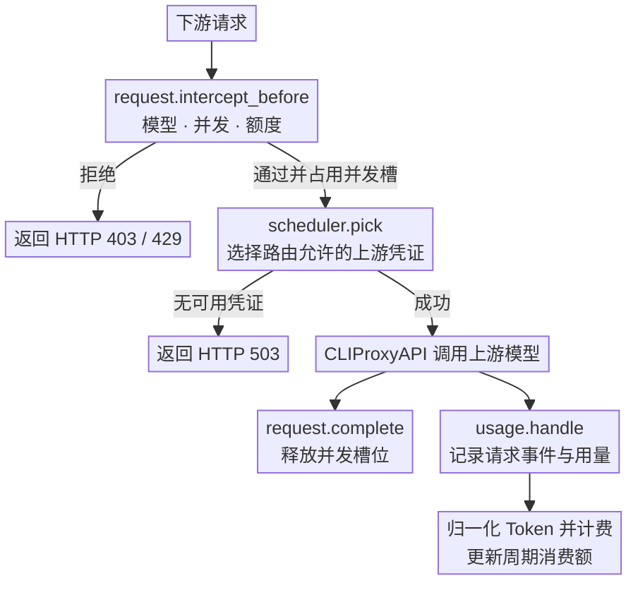
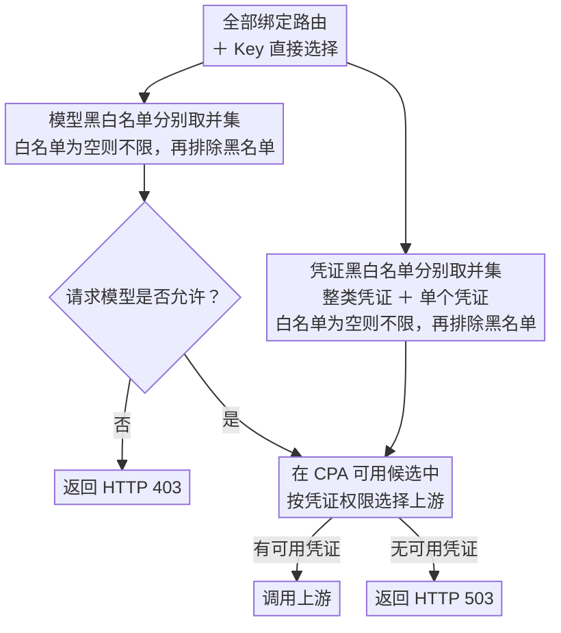

<div align="center">
  <h1>CPA Key Billing</h1>
  <p><strong><a href="https://github.com/router-for-me/CLIProxyAPI">CLIProxyAPI</a> 下游 API Key 计费与订阅额度插件。</strong></p>
  <p>
    <a href="https://github.com/haowang02/cpa-plugin-key-billing/releases/latest"></a>
    <a href="https://github.com/haowang02/cpa-plugin-key-billing/actions/workflows/check.yml"></a>
    
    <a href="./LICENSE"></a>
  </p>
  <p><a href="./README.en.md">English</a> · <strong>简体中文</strong></p>
</div>


## 功能特性

- 支持金额、Token、请求三种额度，可按 API Key 独立计时或按订阅计划统一周期重置
- 支持按输入 Token 阈值切换长上下文**阶梯计价**
- 支持按 API Key 设置**最大并发请求数**
- 支持为每个 API Key 绑定**路由规则**，限制模型访问范围和上游凭证
- 可从 [models.dev](https://models.dev/) 获取模型参考价

## 工作原理

插件会在请求到达上游前检查订阅额度、并发和路由。上游调用结束后，CLIProxyAPI 通过 `usage.handle` 提供用量。插件据此记录请求事件、计算费用并更新周期消费额。



## 环境要求

- CLIProxyAPI `7.2.143` 或更高版本，建议使用最新版本
- 使用支持插件的 CLIProxyAPI 构建，不要使用 no-plugin 版本

## 安装

在 CLIProxyAPI 根目录运行。macOS 和 Linux 使用：

```sh
curl -LsSf https://raw.githubusercontent.com/haowang02/cpa-plugin-key-billing/main/install.sh | sh
```

Windows 请先停止 CLIProxyAPI，再在 PowerShell 中运行：

```powershell
irm https://raw.githubusercontent.com/haowang02/cpa-plugin-key-billing/main/install.ps1 | iex
```

安装脚本会将插件安装到当前目录的 `plugins/`。安装或升级完成后需要重启 CLIProxyAPI。

也可以从 [Releases](../../releases/latest) 下载对应平台的发布包，解压后将动态库放入 CLIProxyAPI 的 `plugins/` 目录：

```text
plugins/cpa-key-billing.so       # Linux
plugins/cpa-key-billing.dylib    # macOS
plugins/cpa-key-billing.dll      # Windows
```

## 配置

在 CLIProxyAPI 配置文件中加入：

```yaml
plugins:
  enabled: true
  dir: "plugins"
  configs:
    cpa-key-billing:
      enabled: true
      debug: false # 是否记录 debug 日志，例如路由日志、匹配参考价日志
      codex_fast_mode_billing: false # 开启后，Codex 的 priority 请求按 2.5 倍计费
      mask_api_key_view_emails: false # 对 API Key 查询页面返回的邮箱进行掩码脱敏
      allow_api_key_quota_reset: false # 允许 API Key 用户重置可访问的 Codex 认证文件额度，消耗上游重置次数
      smart_quota_priorities: [] # 可选：按优先顺序填写智能调度的 auth ID
      smart_providers: [] # 可选：限制智能调度处理的 provider
      smart_five_hour_boost: false # 用一次合适的真实请求启动闲置 5 小时窗口的倒计时
      state_file: "plugins/cpa-key-billing-state-v1.db"
```

> [!WARNING]
> 升级前请备份数据文件。
>
> - v1.0.0 至最新版本的数据库文件支持自动迁移。
> - v0.8.4 及更早版本的 JSON 或 SQLite 数据文件不支持迁移，请将 `state_file` 指向新文件。

重启 CLIProxyAPI 后，在管理中心打开「API Key Billing」。确认模型定价后，创建订阅计划并绑定需要限制的 API Key。

### 从全新 CLIProxyAPI 到插件：端到端部署

下面的流程适合一台没有现成 CPA 配置的 Linux 主机。命令中的路径可以替换，但
`plugins/`、配置文件和状态数据库必须属于同一个 CPA 实例。

1. **准备 CLIProxyAPI。** 从 CPA 发布页下载支持插件的 Linux 二进制，放到独立目录并赋予执行权限：

   ```sh
   mkdir -p "$HOME/cliproxyapi/plugins" "$HOME/cliproxyapi/auth"
   cd "$HOME/cliproxyapi"
   # 将下载的 cli-proxy-api 放到当前目录
   chmod 0755 cli-proxy-api
   ```

2. **准备 CPA 配置和认证。** 在 `~/cliproxyapi/config.yaml` 中至少配置监听端口、认证目录和插件目录。先启动一次 CPA，
   使用 CPA 管理中心完成 Codex 等上游认证，再停止它；不要把访问令牌写入配置或提交到 Git。

   ```yaml
   port: 8088
   auth-dir: /home/ubuntu/cliproxyapi/auth
   plugins:
     enabled: true
     dir: /home/ubuntu/cliproxyapi/plugins
   ```

3. **安装本插件。** 在 CPA 根目录执行安装脚本，或从 Release 下载对应动态库并放入 `~/cliproxyapi/plugins/`：

   ```sh
   curl -LsSf https://raw.githubusercontent.com/moreD/cpa-plugin-key-billing/main/install.sh | sh
   ```

   安装后应存在 `plugins/cpa-key-billing.so`（macOS 为 `.dylib`，Windows 为 `.dll`）。

4. **启用插件并指定状态库。** 把插件配置合并到同一个 `config.yaml`；使用绝对路径可以避免服务工作目录变化导致状态库分裂：

   ```yaml
   plugins:
     enabled: true
     dir: /home/ubuntu/cliproxyapi/plugins
     configs:
       cpa-key-billing:
         enabled: true
         scheduler_mode: smart
         state_file: /home/ubuntu/cliproxyapi/plugins/cpa-key-billing-state-v1.db
   ```

5. **作为用户服务运行。** 首次验证可以直接执行 `./cli-proxy-api -config ./config.yaml`。长期运行建议使用 systemd 用户服务：

   ```ini
   # ~/.config/systemd/user/cliproxyapi.service
   [Unit]
   Description=CLIProxyAPI Service
   After=network-online.target

   [Service]
   WorkingDirectory=%h/cliproxyapi
   ExecStart=%h/cliproxyapi/cli-proxy-api -config %h/cliproxyapi/config.yaml
   Restart=on-failure
   RestartSec=3

   [Install]
   WantedBy=default.target
   ```

   ```sh
   systemctl --user daemon-reload
   systemctl --user enable --now cliproxyapi.service
   systemctl --user status cliproxyapi.service
   ```

6. **验证插件和数据流。** 确认日志显示插件注册成功，然后打开 `http://<CPA 地址>:8088/v0/resource/plugins/cpa-key-billing/ui`：

   ```sh
   journalctl --user -u cliproxyapi.service -n 100 --no-pager | grep 'plugin registered'
   curl -fsS http://127.0.0.1:8088/
   ```

   每次请求的计费事件、Codex 响应中的 5 小时/7 天窗口，以及后台额度查询得到的重置次数和过期时间都会写入同一个
   `state_file`，并在认证文件页显示。后台定时器每小时检查到期快照；没有请求用量的认证使用 40–80 分钟随机重查，
   已有请求用量的认证使用 1200–1600 分钟随机重查。

升级插件前先备份状态库，并使用用户服务重启：

```sh
cp plugins/cpa-key-billing-state-v1.db "plugins/cpa-key-billing-state-v1.db.$(date -u +%Y%m%dT%H%M%SZ).bak"
systemctl --user restart cliproxyapi.service
```

### 迁移旧版调度器和 API Key 额度

如果 CPA 配置中仍有独立的 `smart-load-balancer` 插件和
`api-keys[].cost-limits`，切换到本插件前运行：

```sh
python3 scripts/migrate_legacy_settings.py --config /path/to/config.yaml
```

脚本会生成可审核的 `config.yaml.migrated.yaml` 和计划清单。清单会把旧的
`7d` 美元额度转换为 7 天订阅计划，并用不可逆的 caller-scope 哈希绑定
API Key；旧的 `cost-limits` 字段会被移除。旧的 `12h` 额度按要求忽略。
独立的 smart-load-balancer 插件及其 registry source 会从新配置移除，旧调度器会替换为内置
smart scheduler，并保留 24 小时 sticky 窗口和每个 profile 8 个请求的默认值。

审核并启用新配置后，可以通过正在运行的插件同步 Key 和计划：

```sh
CPA_MANAGEMENT_KEY='your-management-key' \
  python3 scripts/migrate_legacy_settings.py \
    --config /path/to/config.yaml.migrated.yaml \
    --manifest /path/to/config.yaml.migration.json --apply
```

只有明确需要自动替换原文件时才使用 `--in-place`；脚本会先生成带时间戳的备份。

## 页面访问

管理员可以从 CLIProxyAPI 管理中心的「API Key Billing」菜单进入，也可以直接打开：

```text
http(s)://<CLIProxyAPI 地址>/v0/resource/plugins/cpa-key-billing/ui
```

普通用户使用自己的 API Key 查询订阅额度和用量时，直接打开：

```text
http(s)://<CLIProxyAPI 地址>/v0/resource/plugins/cpa-key-billing/ui#account
```

## 计费与订阅规则

当 `scheduler_mode` 为 `smart` 时，内置调度器沿用 smart-load-balancer 的行为：保持每个 Key 的绑定，优先使用长窗口更早重置的 profile，跳过额度信号标记为阻塞的 profile，并借用一次合适的真实请求刷新过期或全新的 profile。它不会生成独立探测请求。`smart_quota_priorities` 和 `smart_five_hour_boost` 是可选高级配置。

- 未绑定订阅计划的 API Key 只统计用量，不限制额度。
- 订阅计划可设置多个自定义额度窗口，每个窗口可单独或组合限制金额、Token、请求数。
- 每个 API Key 独立记账。独立周期从首次放行开始；统一周期可为各窗口指定下次开始时间，所有绑定 Key 按固定时间重置。
- 手动重置额度时，统一周期的重置时间保持不变；独立周期在下一次放行时重新开始。
- 自定义价优先于 models.dev 参考价，两者都没有时拒绝新请求。
- 请求事件保留最近 365 天。

## 路由规则

在 API Key 页面绑定路由规则，也可直接选择模型、整类凭证或单个凭证。点击模型或凭证的选框，可在未选择、白名单（勾号）、黑名单（叉号）之间切换。整类凭证包含该类别后续新增的凭证，也可用黑名单排除其中的单个凭证。模型与凭证分别合并所有绑定规则和直接选择：白名单取并集，黑名单取并集，黑名单优先。白名单为空时允许全部，再排除黑名单。



## 拦截请求的响应

| 场景 | 状态码 | `type` | `code` |
| --- | --- | --- | --- |
| API Key 并发已满 | `429` | `rate_limit_error` | `rate_limit_exceeded` |
| 订阅额度用尽 | `429` | `rate_limit_error` | `rate_limit_exceeded` |
| 模型无权访问 | `403` | `permission_error` | `insufficient_quota` |
| 没有符合规则且可用的凭证 | `503` | `server_error` | `internal_server_error` |
| 已绑定的路由规则不存在或损坏 | `503` | `server_error` | `routing_configuration_error` |
| 模型未定价 | `503` | `cpa_key_billing_error` | `model_price_error` |

## 致谢

- [LINUX DO](https://linux.do/) - 新的理想型社区
